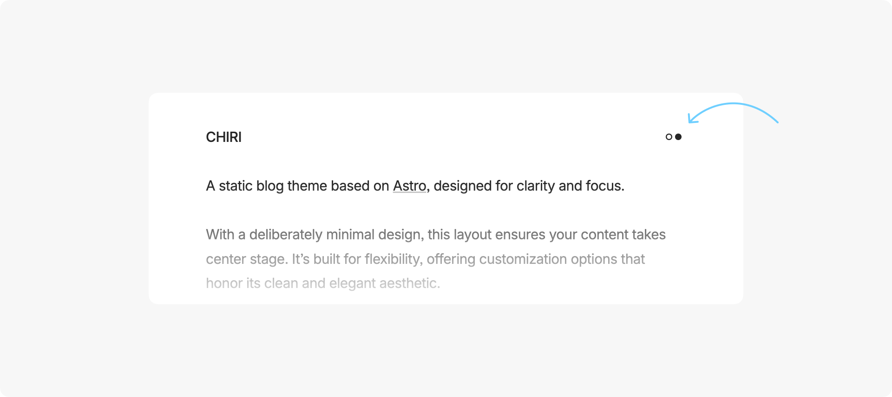
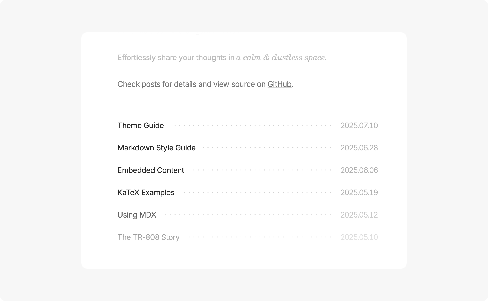
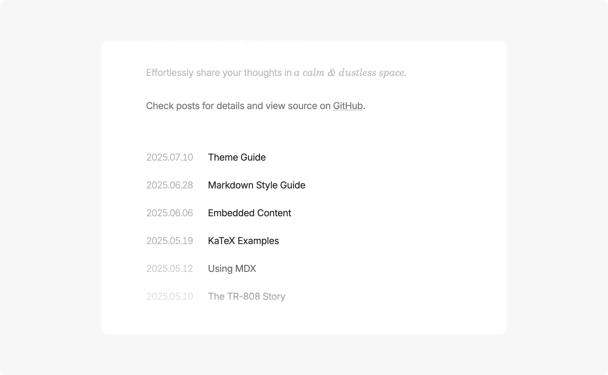
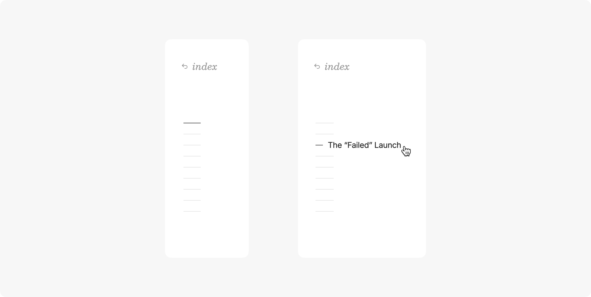
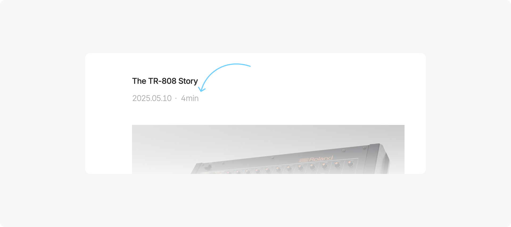
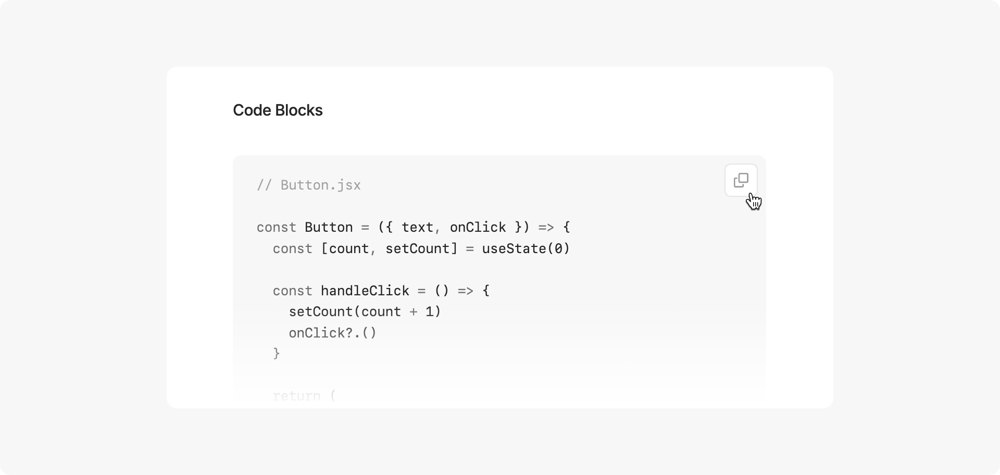

Chiri 是一个基于 [Astro](https://astro.build) 构建的极简博客主题，提供丰富的自定义选项，同时保持简洁的美学风格。

---

## 基本命令

- `pnpm new <title>` - 创建新文章（使用 `_title` 作为草稿）
- `pnpm update-theme` - 更新主题到最新版本

## 主要文件和目录

- `src/content/about/about.md` - 编辑首页顶部的关于区域，留空则不显示任何内容
- `src/content/posts/` - 所有博客文章存放于此
- `src/config.ts` - 配置网站主要信息和设置

```ts
// 网站信息
site: {
  website: 'https://chiri.the3ash.com/', // 网站域名
  title: 'CHIRI', // 网站标题
  author: '3ASH', // 作者名称
  description: '基于 Astro 构建的极简博客', // 网站描述
  language: 'zh-CN' // 默认语言
},
```

```ts
// 通用设置
general: {
  contentWidth: '35rem', // 内容区宽度
  centeredLayout: true, // 使用居中布局（false 为左对齐）
  themeToggle: false, // 显示主题切换按钮（默认使用系统主题）
  postListDottedDivider: false, // 在文章列表中显示点状分隔线
  footer: true, // 显示页脚
  fadeAnimation: true // 启用淡入动画
},
```

```ts
// 日期设置
date: {
  dateFormat: 'YYYY-MM-DD', // 日期格式：YYYY-MM-DD, MM-DD-YYYY, DD-MM-YYYY, MONTH DAY YYYY, DAY MONTH YYYY
  dateSeparator: '.', // 日期分隔符：. - /（MONTH DAY YYYY 和 DAY MONTH YYYY 格式除外）
  dateOnRight: true // 文章列表中日期位置（true 为右侧，false 为左侧）
},
```

```ts
// 文章设置
post: {
  readingTime: false, // 显示阅读时间
  toc: true, // 显示目录（当页面宽度足够时）
  imageViewer: true, // 启用图片查看器
  copyCode: true, // 启用代码块复制按钮
  linkCard: true // 启用链接卡片
}
```

## 文章 Frontmatter

只有 `title` 和 `pubDate` 是必填字段

```ts
---
title: '文章标题'
pubDate: '2025-07-10'
category: '分类名称'
tags: ['标签1', '标签2']
---
```

## 语法高亮

你可以通过 `astro.config.ts` 中的 `shikiConfig` 配置主题。

更多详情：[语法高亮 | Astro 文档](https://docs.astro.build/zh-cn/guides/syntax-highlighting/)

```ts
import { defineConfig } from 'astro/config'

export default defineConfig({
  markdown: {
    shikiConfig: {
      light: 'github-light',
      dark: 'github-dark',
      wrap: false
    }
  }
})
```

---

## 部分功能预览












