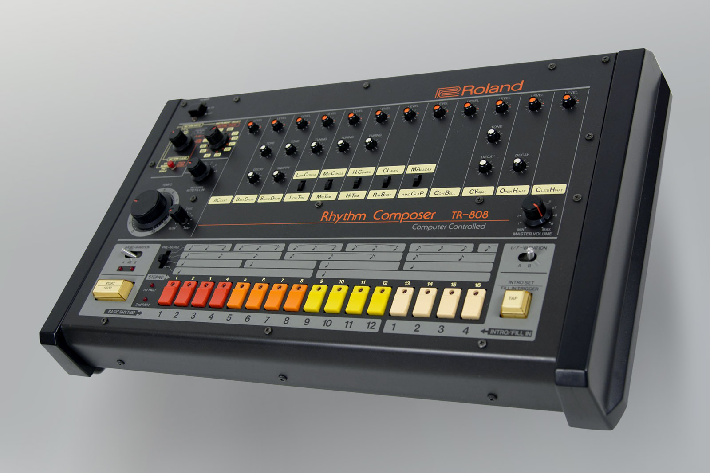

Roland TR-808 节奏编曲器，通常简称为"808"，是有史以来最具影响力的电子乐器之一。尽管它最初在商业上遭遇失败，这台鼓机后来塑造了整个音乐流派，成为了文化标志。这是一个关于一台本意取代鼓手的机器如何最终革新音乐制作的故事。

## 808 的诞生

20 世纪 70 年代末，Roland 公司希望创造一台价格实惠的鼓机，与使用数字采样的昂贵 Linn LM-1 竞争。由**梯郁太郎**领导的公司工程师团队决定另辟蹊径——创造一台使用**模拟合成**而非数字采样来生成鼓声的机器。

开发团队面临几个挑战：

1. **成本限制** - 机器需要让家庭音乐人负担得起
2. **声音设计** - 仅使用模拟电路创造逼真的鼓声
3. **用户界面** - 让音乐人能够直观地编程节奏

> "我们想创造一种能让鼓手过时的东西，但结果我们创造了一种让每个人都想成为鼓手的东西。" — 梯郁太郎

## "失败"的发布

当 TR-808 于 1980 年发布时，销售令人失望。这台机器售价 1,195 美元（相当于今天约 4,000 美元），因其"不够逼真"的鼓声而受到批评。专业录音室更青睐使用真实鼓声采样的更昂贵的 Linn LM-1。

808 的模拟声音被认为过于电子化和人工：

- 底鼓太沉闷，缺乏真实鼓的冲击力
- 军鼓有一种独特的"拍掌"声，听起来完全不像真正的军鼓
- 踩镲金属感重且刺耳
- 嗵鼓有一种特征性的"弹跳"声

Roland 在 1983 年停产了 TR-808，仅售出约 **12,000 台**，被认为是商业失败。

## 嘻哈革命

当**嘻哈制作人**发现 TR-808 独特的声音时，它的命运发生了戏剧性转变。20 世纪 80 年代初，纽约的年轻制作人，特别是布朗克斯区的制作人，开始尝试使用这台机器。

早期的关键采用者包括：在"Planet Rock"（1982）中使用 808 的 **Afrika Bambaataa**，在嘻哈中开创使用 808 底鼓的 **Marley Marl**，在早期 Def Jam 唱片中融入 808 声音的 **Rick Rubin**，以及在 Public Enemy 制作中大量使用 808 的 **The Bomb Squad**。

808 独特的底鼓成为了嘻哈节奏骨架的基础。它深沉、共鸣的低音在通过强大的音响系统播放时能够震动整个街区。

## 迈阿密低音现象

20 世纪 80 年代中期，TR-808 在**迈阿密**找到了另一个归宿，成为了一种名为**迈阿密低音**或**电臀低音**的新流派的核心。**2 Live Crew** 等制作人将 808 底鼓作为他们曲目的明星，**DJ Magic Mike** 创作了完全围绕 808 节奏模式构建的专辑，**Luke Skyywalker** 使用 808 创造了标志性的迈阿密之声。

808 产生极低频率的能力使其完美适配迈阿密正在兴起的汽车音响文化，在那里低音澎湃的音乐成为了身份象征。

## 电子音乐与舞曲

TR-808 的影响远远超出了嘻哈。在 20 世纪 80 年代末和 90 年代初，它在浩室音乐和电子音乐中变得不可或缺。**Frankie Knuckles** 和 **Marshall Jefferson** 在早期芝加哥浩室中使用 808，这台机器的踩镲和拍掌成为了浩室音乐的标志性声音。它的可编程序列器允许创作复杂的节奏模式。

在电子音乐中，**Juan Atkins**、**Derrick May** 和 **Kevin Saunderson**（贝尔维尔三人组）将 808 融入底特律电子音乐。这台机器的未来主义声音完美契合电子音乐的机器人美学，其实惠的价格使卧室制作人也能接触到它。

## 现代音乐中的 808

即使在今天，TR-808 通过软件模拟和硬件再版继续影响着音乐制作。**Roland Cloud** 提供官方软件版 808，**Native Instruments** 在其音色库中包含 808 采样，**Ableton Live** 提供受 808 启发的鼓组。

硬件再版包括 **Roland TR-08** 精品系列再版、具有 808 音色的现代鼓机 **Roland TR-8S**，以及价格实惠的原版克隆 **Behringer RD-8**。

## 文化影响

TR-808 已经超越了其作为乐器的角色，成为了**文化符号**。它影响了时尚，出现了 808 主题的服装和配饰；影响了艺术，视觉艺术家在作品中融入 808 图像；影响了电影，出现了关于这台机器影响的纪录片和电影；也影响了文学，出现了庆祝其传奇的书籍和文章。

> "808 不仅改变了音乐——它改变了文化。它给了那些无法获得昂贵录音室设备的社区一个声音。" — Questlove

## 永恒的遗产

Roland TR-808 的故事是**失败如何引向创新**的完美例证。最初被认为是商业失败的产品，成为了 20 世纪最重要的乐器之一。

808 故事的关键教训包括：拥抱不完美（808 的"缺陷"成为了它最大的优势），认识到可及性的重要性（平价工具可以使音乐创作民主化），理解社区采用至关重要（用户经常发现设计师从未想象过的创意应用），以及欣赏永恒的设计可以保持数十年的相关性。

TR-808 的影响力持续增长，证明有时最具革命性的创新来自意想不到的地方。从作为"失败"鼓机的卑微起点到成为文化标志的地位，808 真正赢得了它在音乐史上的地位。

---

_TR-808 可能在 1983 年停产了，但它的节拍仍在继续，激励着新一代音乐人和制作人创造明天的音乐。_
